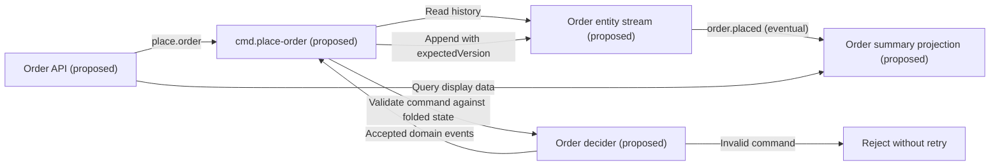

# Mermaid design diagrams

Use diagrams in user-facing design proposals when relationships, ordering, branches,
or lifecycle transitions are easier to review visually. Generate them from the user's
project and proposed design, then update them when the design changes.

## When to draw

| Design question | Mermaid type | Show |
|---|---|---|
| Component boundaries, push/pull, CQRS, streams and projections | `flowchart LR` | Components and labeled event, call, or query edges |
| Dispatch, external calls, waits, retries, compensation | `sequenceDiagram` | Participants and relevant success/failure ordering |
| Entity or workflow lifecycle | `stateDiagram-v2` | States and event-labeled transitions, including failure paths |

For simple SDK lookups, installation commands, or isolated changes with no interaction
to explain, use prose or code. Start with one focused diagram; split it only when
separate concerns make it hard to read. An explicit user request for a diagram takes
precedence over these defaults.

## Output rules

- Emit a fenced `mermaid` block in chat alongside the design proposal, before writing
  application code. Include a short prose explanation so it is useful without rendering.
- Use actual component IDs, event names, and service names found in the project. Label
  new components as proposed and uncertain connections as unverified; do not invent
  existing infrastructure. The example below is illustrative, not a required architecture.
- Label edges to distinguish event publication, direct calls, and read-model queries.
  Show the relevant failure, retry, wait, or compensation path when it affects the design.
- Preserve Ironflow semantics from `patterns.md` and the selected SDK reference:
  entity-stream append already publishes events, projections supply display reads,
  managed reducers are pure, and pull workers poll over HTTP. A diagram must not add
  a second emit for the same appended fact or imply synchronous projection updates.
- Use plain syntax, short labels, stable node IDs, and quoted flowchart labels.
  Let the host control styling; omit init directives, custom CSS, HTML, and click actions.
- Check that the diagram matches the proposal and SDK behavior. Parse/render it with
  existing tools when available; correct syntax errors before delivery and report
  unavailable renderer validation as unverified. Add no dependency just to draw it.
- Keep diagrams in chat unless the user requests a saved design or the workflow already
  requires one. Preserve `ironflow-fit`'s inline SVG in its self-contained HTML report.

## Example: proposed order write and read paths

The handler folds stream history and validates the command before appending accepted
events. The projection consumes the published events asynchronously; the API queries
that read model for display data. Handle version conflicts according to the chosen
SDK and command policy when expanding this design.
